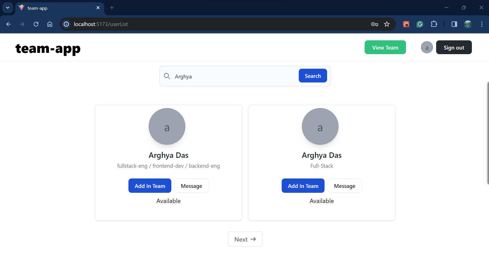

```bash
https://alfa-team-app.netlify.app/

# NOTE! - it may take some time to create or login a account, Because backend server is running on a free tier server

# all mock account's password same as email
```

# UI

1. Create account
   
   ***
2. Login
   
   ***
3. User card  
   
   ***
4. Search By name
   
   ***
5. Teams
   
   ***
6. Team
   
